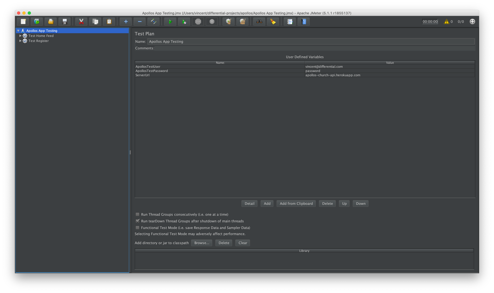
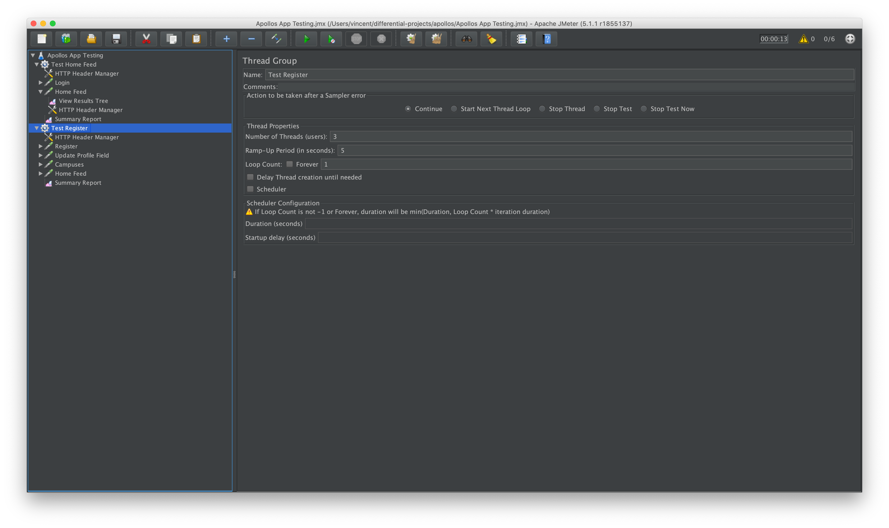
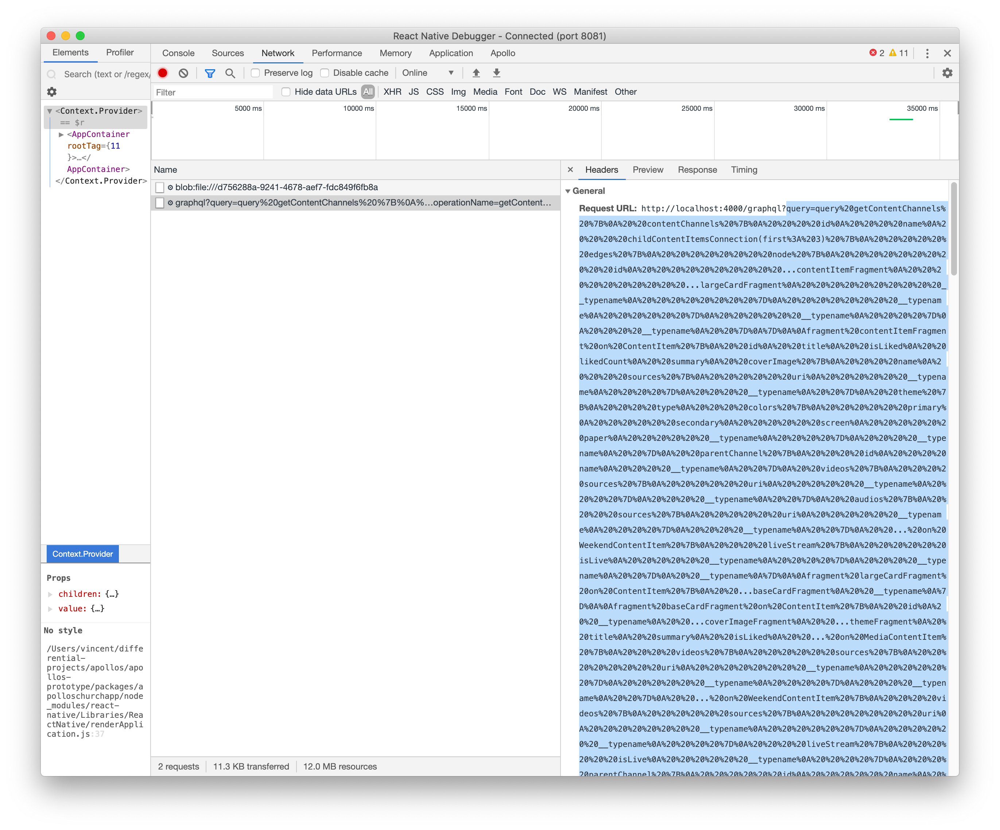
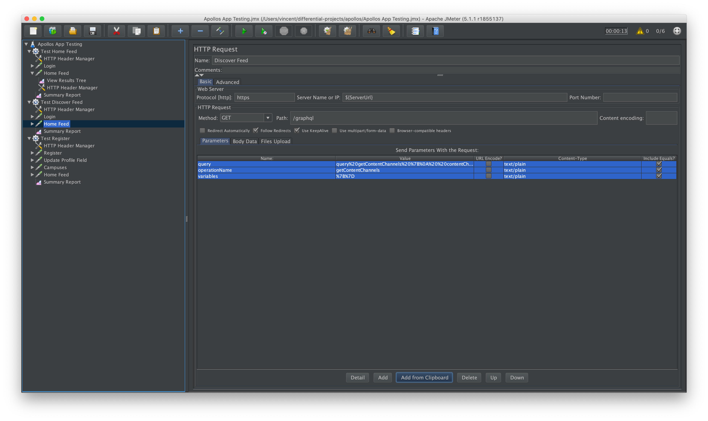
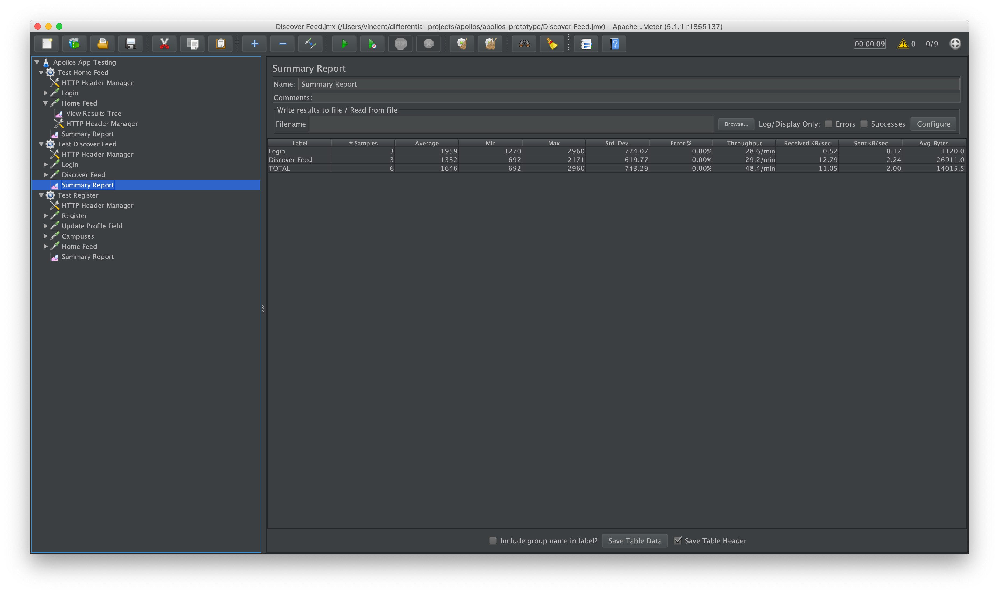

# Load Testing

## Strategy

To facilitate load testing we've put together some tools to help equip your team to both create and run load tests against the Apollos API. All of the load tests that core uses target the Apollos GraphQL API. We have opted to not test Rock directly, because by targeting our Apollos API we can showcase some of the performance advantages provided by our caching mechanisms, as well as some of the disadvantages of our API integration strategies.

## Setup

We have opted to construct a series of sample tests through [JMeter](https://jmeter.apache.org/). Primarily designed for testing web applications, JMeter has the advantage that most SaaS Load Testing providers (such as [Blazemeter](https://www.blazemeter.com/)) are capable of running tests constructed using JMeter.

### Creating and Running JMeter tests

1. Download and install JMeter. This task is up to you. I used `brew install jmeter`.

2. Open the JMeter GUI, then open the `.jmx` file inside the `./load-tests` folder. You should see something like the below. You'll want to start by setting the `ApollosTestUser` and `ApollosTestPassword` to the username and password of a user who can login to Rock. You'll also want to set the `ServerUrl` to the URL of the Apollos Server you wish to test.

2. You can see that we have two "threads" setup. Each thread represents a specific series of requests to make. If you are interested in how Jmeter can be configured, JMeter itself has a helpful [getting started guide](https://jmeter.apache.org/usermanual/get-started.html). If you click on a specific thread, and click the green play button at the top, you'll be able to run the test for that thread.

3. Let's create a new thread, that tests a new endpoint, by duplicating an existing thread. Right click on the "Test Home Feed" thread and click "Duplicate". Now click on the "Home Feed" HTTP request and see that we have prefilled the parameters for the home feed query. Let's replace those with the parameters for the discover feed. Start by deleting all the query parameters.

Open the Apollos App, open the React Native Debugger, and turn on Network Inspecting. Open the discover feed, and take note of the query that runs. You'll want to copy the request URL, specifically everything after the `.../graphql?=`

4. Now let's import that into JMeter. In the JMeter panel, hit "Add From Clipboard" at the bottom.

5. At this point, you're ready to run your new thread targeting the home feed! By duplicating the HTTP Request stages, you'll be able to run multiple different queries after each other. You can use the more advanced JMeter features to capture JSON data as well, and use it in future tests (see the tests over Onboarding)

## In Practice

After you have setup some JMeter tests, you can upload them to a service such as Blazemeter and run the tests at extreme scales (hundreds of users/requests at once). You'll always need to make changes to the tests within JMeter's UI, but once configured correctly you can upload to Blazemeter and tweak the number of users per run / concurrency / etc.