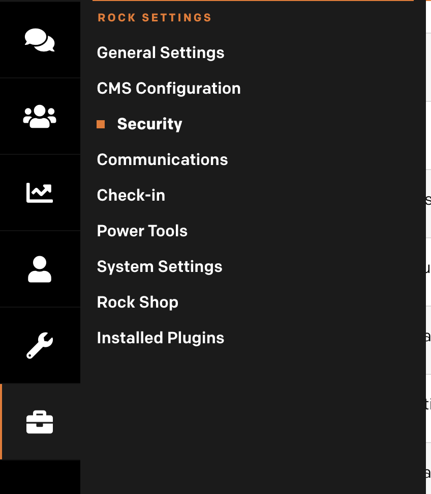
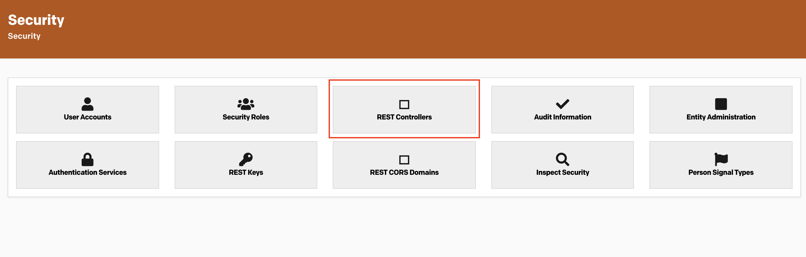
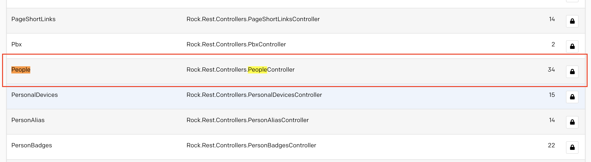
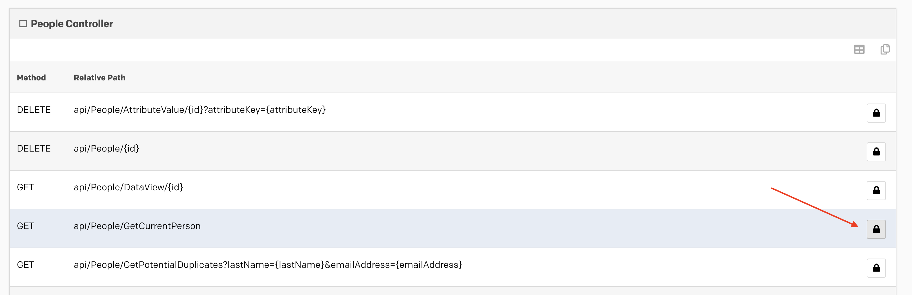
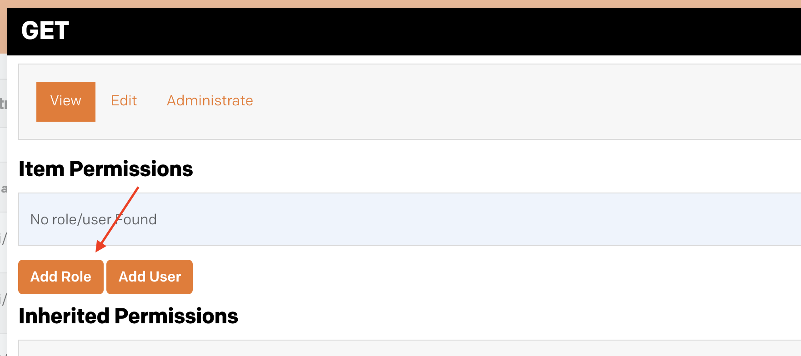
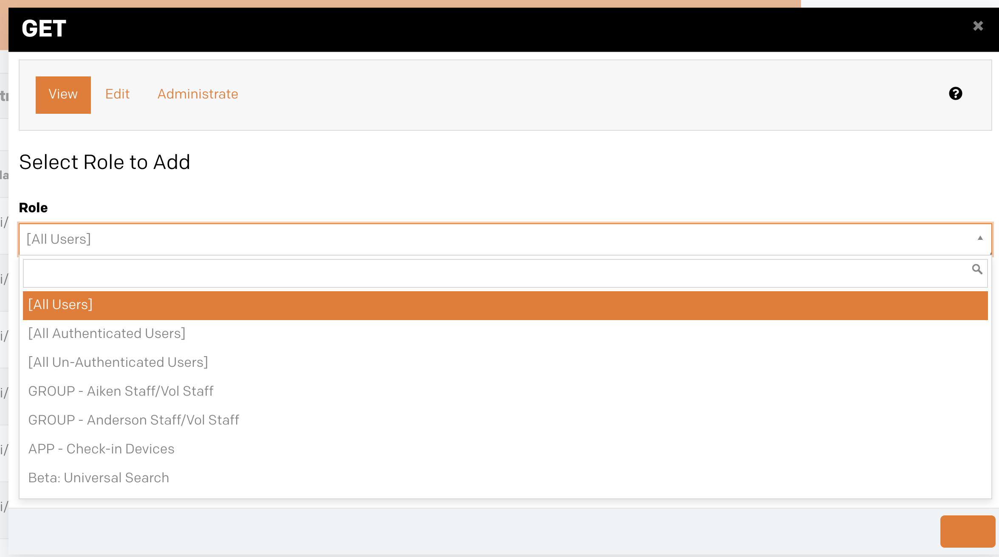
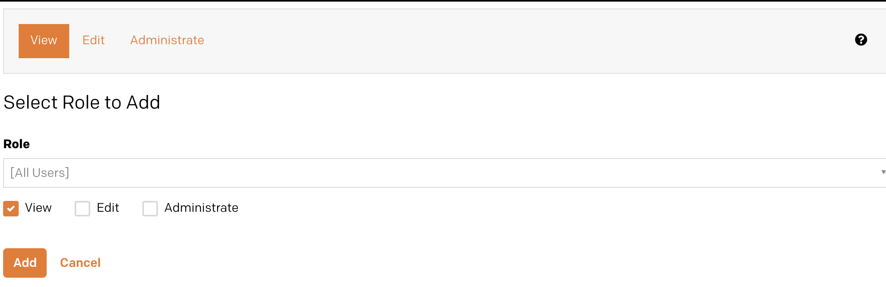

# Setting up Rock for Apollos

## Creating an API user

(todo)

## Unlocking Rock Endpoints

In order for user authentication to work, we need to open up a single Rock REST endpoint. The `People/GetCurrentPerson` endpoint is used extesivly by Apollos to perform user authentication, and needs to be opened up so any user can call that endpoint (not just our API user.)

### Steps to Unlock

1. Visit the Admin Tools -> Security Page

2. Click on the "Rest Controllers" block

3. Find and open the People Controller. It might not be on the first page.

4. From the People Controller, select the `GetCurrentPerson` endpoint security settings.

5. From the "View" tab, select "Add Role"

6. Select "All Users" from the dropdown.

7. With "All Users" and the "View" checkbox checked, click "Add"

## Configuring Content Channels

(todo)